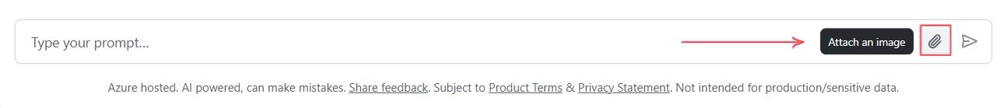
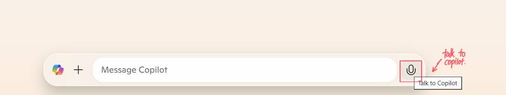
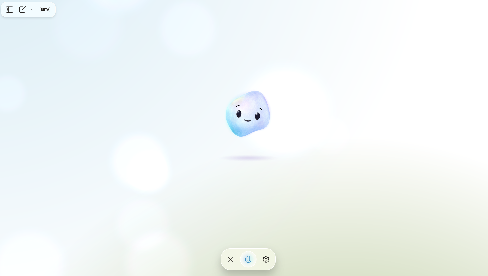
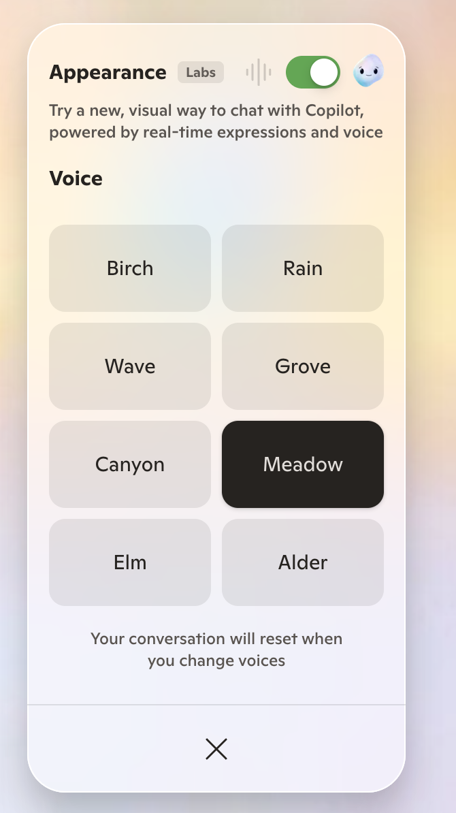

# Part 3 - Multimodal

Until now, we have interacted with LLMs using a single modality: inputting text and receiving either text or images. However, multimodal interfaces are becoming increasingly popular because they allow users to interact with models using multiple modalities, such as text, images, and speech, thereby improving human-computer interactions. In this section, we will explore how to use multimodal interfaces to interact with **GPT-4o mini** and **GPT-4o audio**.


> [!TIP]
> **GPT-4o mini** is a multimodal model that incorporates both natural language processing and visual understanding. It is able to process as input a combination of text and images, and generate an output which is relevant to both modalities.

**GPT-4o realtime** supports low-latency, "speech-in, speech-out" conversational interactions. It is a great fit for use cases involving live interactions between a user and a model, such as customer support agents, voice assistants, and real-time translators.

## Best Practices

- **Contextual specificity**: Adding context to the current scenario provides the model a better understanding of an appropriate output. This level of specificity aids in focusing on relevant aspects and avoiding extraneous details.​

- **Task-oriented prompts**: Focusing on a specific task helps the model to develop the output while taking that perspective into consideration.​

- **Define output format**: Clearly mention the desired format for the output, such as markdown, JSON, HTML, etc. You can also suggest a specific structure, length, or specific attributes about the response.​

- **Handling refusals**: When the model indicates an inability to perform a task, refining the prompt can be an effective solution. More specific prompts can guide the model towards a clearer understanding and better execution of the task. Some tips to keep in mind:​
    - Request explanations for generated responses to enhance transparency in the model's output​
    - If using a single-image prompt, place the image before the text​
    - Ask the model to describe the image in detail first and complete your specific task from the description​

- **Prompt Tuning**: Try prompt tuning techniques that we explored for text generation scenarios such as:​
    - Breaking down requests (e.g., chain of thoughts)​
    - Adding examples (e.g., few-shot learning)​

## Interacting with the model using an Image

1. Navigate to the  **GitHub Models chat.**

> 📌 **Important Note**
> Before you start, click on **Reset Chat History** to avoid any context from previous interactions.

2. In the chat text box, click on the attachment icon to upload a local image.



3. Select the images in the [house images folder](/docs/media/house-multimodal/) and upload them to the chat.

4. Once you have uploaded the file, try this prompts to start interacting with the image:

```
Create a tagline and short description for this rental home advertisement.
- The first picture is from the home
- In the description use the features of the house and make the ad more compelling with the sights. 
- Do not talk about features not visible in the images.
```

## Providing Context

For this next demo, we have an obstructed image. Bounding boxes were purposefully added in the image to obscure the full context.

1. _Reset Chat History_ and in the chat text box, add the prompt: ``Extract all the texts from the image. Explain what you think this is.``
2. Click on the attachment icon and go to Desktop folder and upload [context-001](./media/context-001.png) image and send the prompt.


> You might struggle to identify this text if I asked, 'Hey, what is this?' This demonstrates a classic computer vision challenge in optical character recognition: deciphering unclear, isolated words. Now, if I use gpt-4o-mini and ask, 'What is this?', it responds, 'The text is not clearly readable due to its handwritten style. It could be something like “Mark.”' Remarkably, it also notes, 'Some portions of the text appear to be blocked and cannot be read.'

3. We will add a new image, go to Desktop folder and upload [context-002](./media/context-002.png) image to our chat, with the prompt ```Extract all the texts from the image. Explain what you think this is.```

> Revealing a bit more, it's still quite challenging to identify what it is. This time, the prompt is adjusted slightly to: 'Extract all the text from the image. Explain what you think this is.' gpt-4o-mini responded, 'This says "milk, steak" and appears to be a shopping list.' It also noted that the image is still partially obscured, which is quite interesting.

4. We will add a new final image, go to Desktop folder and upload [context-003](./media/context-003.png) image to our chat, with the prompt: ```Extract all the texts from the image. Explain what you think this is.```

> Upon revealing the entire image, we see that gpt-4o-mini was correct—it is indeed a shopping list. It accurately identifies items like 'mayo' and 'organic bread.' Even more intriguing is its interpretation of the note at the bottom. It captures the subtle context, stating, 'The note on the beer item suggests a reminder or an emphasis on moderation or limiting the quantity.

## Real time-audio interactions

By integrating the **gpt-4o-realtime-preview** model, users can interact with the platform using voice commands, making the shopping experience more engaging and accessible.

1. Navigate back to **Microsoft Copilot** and select **Start new chat**


2. Select the talk to Copilot option, a pop up will appear, click allow to enable interactions with audio.



3. Start interacting with Copilot with the following prompts:




    ```Copilot, teach me some Italian phrases!```
    ```Copilot, recommend me some hidden travel gems in Africa.```
    ```Copilot, brainstorm some unique birthday gift ideas.```
    ```Hey Copilot, how do I make the perfect pot of tea?```

> [!TIP]
> You can select Settings to change the voices between Birch, Rain, Elm, Alder, Wave, Grove, Canyon and Meadow.



## Next Steps

Congratulations! You have now completed the lab and you learnt how to interact with multimodal models. 

Move to [Summary](06_Summary.md) to proceed to complete the lab.